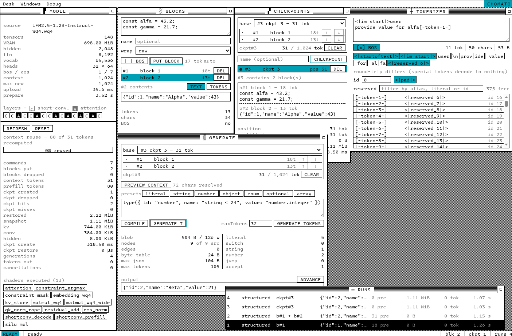

# Chomato




Experimental local LFM2.5 inference runtime built on WebGPU with exact reusable checkpoints and GPU-resident typed structured generation.

View the [Online demo](https://3ksoft.github.io/chomato/) (WebGPU capable browser required, chrome/webkit only currently)

```ts
const result = await engine.generate(
  type({ id: "number", name: "string < 64" }),
  { checkpoint, blocks },
);
```

The core API generates a value of the requested type from an ordered context. It is not centered on chat templates or text-only completion; a plain text result is simply a bounded string schema.

## Repository shape

The repository is split by implementation ownership:

```text
packages/
  engine-ts/    public engine API + transport/protocol + constraint compiler
  webgpu/       LFM2 definition, shaders, forward/checkpoint logic, GPU runtime
  lfm2/         model metadata and tokenizer
  quant/        GGUF/WQ4 quantized model tooling/runtime support
  schema/       shared CPU/GPU ABI schemas and generated codec
  bridge/       stdio frame protocol between engine and a host process
  backend/      out-of-process engine hosts, incl. the native (scriptc) target
  finetune/     structured-generation datasets/tooling
  gui/          developer UI exposing the engine primitives

tests/          public/real-engine correctness and E2E tests
docs/           current architecture + implementation notes
misc/           historical one-off probes/benchmarks
```

The precise package graph continues to evolve, but the stable responsibility boundary is:

```text
schema/quant/model data
        ↓
LFM2 definition + Sandblaster AOT programs
        ↓
WebGPU runtime/backend
        ↓
engine-ts public API
```

## Current execution model

Build time:

```text
WGSL shader bodies/includes
→ Sandblaster link
→ serialized LFM2 artifact
```

Runtime:

```text
load model
→ recreate handles from the artifact, compile for GPUDevice
→ prefill / decode / checkpoint / structured generation
```

The runtime never re-declares the resource graph — `Sandblaster.fromArtifact()` builds the handles from the serialized plans, which keeps arktype and the schema tooling out of the runtime entirely. See [docs/runtime.md](docs/runtime.md).

Structured generation runs:

```text
model forward -> logits
→ exact GPU token mask
→ constrained argmax + decoder-state commit
→ strict JSON value
→ JSON.parse
→ T
```

For the current 65,536-token vocabulary the exact mask is 8 KiB (`2,048 × u32`).

## Checkpoints

`ContextCheckpoint` is a physical exact continuation snapshot, not prompt replay metadata.

For LFM2.5 it contains:

- populated attention KV prefix,
- fixed-size rolling short-convolution state,
- continuation metadata.

Restoring a checkpoint does not re-prefill its source prefix. Checkpoints can branch, chain, and survive dropping their source blocks.

## Current limits

The present implementation is intentionally focused:

- model: `LFM2.5-1.2B-Instruct`,
- vocabulary: 65,536,
- runtime context capacity: 1,024 tokens,
- decode allocation: up to 1,024 tokens subject to remaining context capacity,
- structured output: finite/bounded schema envelope rather than full JSON Schema,
- current structured sampler path: full-vocabulary masked dense, not sparse LM-head execution.

## Tests

Run the complete suite with:

```bash
bun test
```

The suite includes real-engine checkpoint tests, structured-generation E2E tests, transport tests, and WebGPU/Sandblaster regression coverage.

For the current Krystal policy connected to the Pirapitinga Village GUI, see
[docs/PIRA_SIMULATION.md](docs/PIRA_SIMULATION.md).

## Publishing the developer GUI

```bash
DRY_RUN=1 bun run deploy:pages   # build, commit to gh-pages, stop
bun run deploy:pages             # …and push
```

The site is built locally and pushed to an orphan `gh-pages` branch through a
throwaway worktree, so nothing built ever lands on `main`. Point the repository's
Pages source at branch `gh-pages`, folder `/`.

Two constraints shape this, and both are worth knowing before reaching for a
GitHub Actions workflow instead:

- **The build cannot run on a runner.** `@sandblaster/core` and `@schema-pop/*`
  are `link:` dependencies on sibling checkouts and are not published to npm, so
  `bun install` fails anywhere but a machine that has them.
- **The model is not published and cannot be.** It is a single ~700 MB file,
  against GitHub's 100 MB per-file limit and the 1 GB Pages site limit.

The weights live in a HuggingFace repo instead, and the built GUI points at them
by default. The GUI reads the model in ranges rather than downloading it whole,
so its host must answer HTTP range requests *and* send permissive CORS. GitHub
Pages does neither for this purpose; HuggingFace does both, including after the
CDN redirect (verified: `206 Partial Content`, `accept-ranges: bytes`,
`access-control-allow-origin: *` on a 709 MB LFS file). The file picker stays as
the way to load a local copy without the download.

| variable | effect |
|---|---|
| `BASE_PATH` | path prefix for the build, default `/chomato/` |
| `VITE_MODEL_URL` | model the built GUI loads, default the HuggingFace `resolve/main` URL |
| `VITE_MODEL_DOWNLOAD_URL` | where the GUI's model link points, default the HuggingFace repo |

Note that the `.wq4` is a quantized derivative of `LiquidAI/LFM2.5-1.2B-Instruct`
and carries that model's licence (`other` / `lfm1.0`), which is separate from
this repository's AGPL on the code.

## Documentation

Start with [docs/README.md](docs/README.md) and [docs/architecture.md](docs/architecture.md).

The focused technical documents are:

- [runtime/WebGPU execution](docs/runtime.md)
- [context state/checkpoints](docs/checkpoints.md)
- [structured generation](docs/structured-generation.md)


## Contributors

[kodown1k](https://github.com/kodown1k)

---
