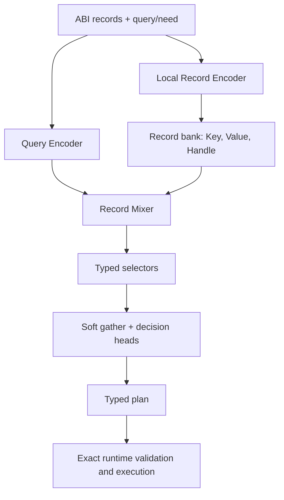

# Krystal Brain Architecture v2

**Status:** Architectural Contract Draft 2.0  
**Scope:** Forward pass, Model ABI, Division of responsibilities (Compiler / Runtime / Brain)  
**Out of Scope:** Curriculum, Data generation, Backward pass, Optimizer, and Training schedule  

---

## 1. Objective

Brain v2 is not a small language model reading flattened text. It is a compact, record-based decision model operating on a compiled ABI of the world.

Its primary execution flow is:

> **encode records → encode query/need → select → soft gather → decide → emit typed plan**

The model is designed to learn semantic selection: which record, action intent, or argument is relevant. It is not intended to replace the type system, perform exact arithmetic, or modify the world state directly.



---

## 2. Core Insights Behind v2

| Observation | Architectural Consequence |
|---|---|
| Merely expanding data improved scores from ~75% to 84–86%, but did not solve the task | Data and architecture solve distinct problems; v2 cannot rely solely on broader coverage |
| Soft gather raised S0 from 0.75 to 1.00 across train/dev/test | Pointer/Selection mechanism is part of the primary compute path, not an auxiliary head |
| Uniform gather with the same parameter count yielded 0.50 | The gain stems from selecting the correct record, not from widening the head |
| G3 achieved full stability thanks to intra-record bonding | A record is a strict, atomic unit of local encoding |
| Grouped RoPE created shortcuts and degraded tail performance | We do not encode structure via artificial position sharing |
| Sparse valid shapes did not generalize well in a single-day memorized lookup table | Type and field roles must be explicit; token patterns alone do not define a schema |
| Exact references and arithmetic are already known to the runtime | Brain selects handles and operations; Runtime executes them without approximation |

---

## 3. System Boundaries

### 3.1 Compiler

The Compiler maintains full static knowledge and emits:
- Semantic vocabulary with stable identifiers.
- `RecordType` schemas, field roles, and arity rules.
- `ActionIntent` catalog along with typed argument slots.
- Type compatibility, valid candidate sets, and masks.
- GPU buffer layouts and model computation graph metadata.
- Compatibility hashes for ABI, vocabulary, model, and plan.

### 3.2 Runtime

The Runtime is the ground truth for exact logic:
- Token, record, entity, reference, and slot identities.
- Operation validity and type conformity.
- Current world state, history, lifetimes, and snapshots.
- Arithmetic, exact comparisons, and ALU operations.
- Reading typed fields from a selected `RecordHandle`.
- Plan validation, lowering, and execution.
- Composing the active brain frame from sensory bands.
- Caching and invalidating record representations.

### 3.3 Brain

The Brain is responsible exclusively for learned semantic choices:
- Encoding the semantics of records and query/need.
- Plan route selection.
- Pointing to an `ActionIntent` or other control record.
- Pointing to records for typed arguments.
- Gathering pointed representations and making semantic decisions.
- Emitting a fixed, validatable plan shape.

The neuron's hidden state must never be the sole source of truth about the world. Every decision must be reproducible given the explicit brain frame and the model version.

---

## 4. Record ABI

### 4.1 Records Do Not Require Fixed Length

The **type schema** is fixed, not the global length of every record. Each `RecordType` defines:
- Canonical field order.
- Known field roles.
- Fixed or bounded arity.
- Length validity rules.
- A `fieldRole → offset` map or a rule for its computation.

The physical input format is packed:

```text
tokens[T]
fieldRoles[T]
recordDescriptors[R] = {
  tokenOffset,
  tokenLength,
  schemaId,
  bandId,
  flags,
  handle
}
```

`handle` is not a semantic embedding. It is an exact handle passed alongside the tensor so pointer outputs can be mapped back to runtime objects.

### 4.2 Rigid Internally, Fluid Externally

- Fields inside a record always follow the canonical order.
- Records belonging to a set receive no learned absolute index.
- Permuting unordered records must not change the semantic output (except for records with explicit ordering semantics).
- Time, epoch, and sequence numbers are standard typed fields, not implicit side-effects of tape positions.
- Local positions reset at the beginning of each record.

### 4.3 Input Embedding

For a field token:

\[
x_t = E_{token}[id_t] + E_{field}[role_t] + E_{schema}[schema_t] + E_{band}[band_t] + E_{stream}[stream_t]
\]

`E_recordIndex` is intentionally absent. An optional local position within the record may be used, but it does not replace `fieldRole`.

Structural metadata should use small, dedicated embedding tables to avoid unnecessarily occupying IDs in the concept vocabulary.

---

## 5. Brain Frame and Sensory Bands

A frame has a single shared limit for active tokens:
- **Standard profile:** up to 512 tokens.
- **Hard v2 capacity:** up to 1536 active tokens.
- **Execution:** runs on `activeTokenCount` only; padding up to the maximum is ignored.

Slot geometry and processing capacity are deliberately separate. The frame owns
288 record slots (2304 token positions) so bands have room for records a game
may one day supply, while the encoder arena is sized for the 1536 active tokens
it can actually process at once — attention memory is quadratic in tokens and
only linear in records, so an unoccupied slot is nearly free and an occupied one
is not.

There is no fixed 256-token quota per band. The runtime maintains separate buffers or ring buffers for vision, audio, touch, proprioception, interoception, communication, and other sources. The frame composer selects whole records based on recency, delta/change, saliency, and the current need/query.

A record must never be truncated into an illegal shape simply to fit the budget. If capacity is exceeded, the runtime drops the whole record, emits a valid summary record, or uses an alternative representation defined by the schema.

Static records (such as the capability catalog) can reside outside the dynamic sensory stream and be cached after encoding.

---

## 6. Logical Model Topology

V2 freezes the data flow while leaving block and head counts as tunable model profile parameters.

### 6.1 Record Encoder

A single shared, local encoder encodes each record independently. Attention masks strictly prevent attention from crossing record boundaries. For short records, implementations may use LFM2 ShortConv blocks, local attention, or a combination of both.

The encoder outputs:

```text
RecordState {
  key[H],
  value[H],
  optionalFieldStates[L, H]
}
```

`key` is used for retrieval, `value` for downstream decisions. They should not be forced into the same pooling. Default pooling is role-aware or utilizes dedicated learned `KEY` and `VALUE` slots; simple token averaging is not part of the v2 contract.

`optionalFieldStates` are stored only for schemas where field selection is explicitly learned. If a field can be derived strictly from the schema, the runtime resolves it after record selection.

### 6.2 Query Encoder

The query, need, or current goal is encoded via a separate stream. The encoder may share weights with the Record Encoder, but receives a distinct `streamRole`.

The query is not prepended to a flat, causal sequence. Such a layout allows records to attend to the query, but prevents the query from attending to later records. V2 mandates explicit cross-attention.

### 6.3 Record Bank

Local encoding produces the record bank:

```text
keys[R, H]
values[R, H]
handles[R]
schemaIds[R]
candidateMetadata[R]
```

Global interaction cost scales with record count $R$, not the quadratic of raw tokens $T^2$. For ~1536 tokens and ~288 record slots, this represents a significantly smaller mixing space.

### 6.4 Record Mixer

The mixer updates query states via cross-attention to the record bank. Default v2 does not perform full record↔record self-attention unless a specific task demonstrates the need.

Historical G3 results proved that the model requires explicit intra-record bonding. In v2, this bond is enforced via a stronger contract: isolated local record encoding. We do not transfer G3 bias directly onto a flattened global tape.

---

## 7. Core Mechanism: select → soft gather → decide

For a given slot $s$, the selector computes logits over valid records:

\[
\ell_{s,i} = score(q_s, key_i) + mask_{s,i}
\]

where `mask` is $0$ for valid candidates and $-\infty$ for candidates disallowed by the ABI.

\[
p_{s} = \text{softmax}(\ell_s), \qquad g_s = \sum_i p_{s,i} \cdot value_i
\]

$g_s$ is the soft gather of the indicated information. The downstream head makes decisions based on $g_s$, the query, and any previously gathered arguments.

At the runtime boundary, the pointer becomes exact:

```text
selectedHandle = handles[argmax(p_s)]
```

Soft gather is part of the forward pass even when the final output is a pointer. This ensures downstream decisions strictly depend on the content of the selected candidate.

Each selector:
- Has a candidate mask derived from the slot type.
- Can receive an explicit `NONE` candidate if permitted by the schema.
- Returns a diagnostic distribution alongside the exact index.
- Must never point to padding, truncated records, or invalid types.

---

## 8. ActionIntent as a Capability Catalog

All actions known to a compiled world are represented as static, typed `ActionIntent` records. Example contract:

```text
ActionIntent {
  actionOpcode,
  semanticIntent,
  actorType,
  argumentSchema,
  effectClass,
  capabilityClass,
  preconditionClass
}
```

The exact field layout depends on the ABI. Crucially, the record carries both semantic meaning and an exact operation identifier.

Action plans are constructed hierarchically:
1. `RouteHead` selects the plan family (e.g., `DIRECT`, `ACTION`, `ALU`, or another ABI enum).
2. For an `ACTION` route, a selector points to an `ActionIntent` record.
3. The selected intent determines the schema and order of argument slots.
4. Each learned slot gets its own typed record selector.
5. Gathered arguments can condition the selection of subsequent slots and the final decision head.
6. The runtime maps handles to exact fields, validates the plan, and executes the opcode.

A separate learned `OpcodeHead` is redundant if the opcode is unambiguously implied by the chosen `ActionIntent`. Duplicating both predictions invites contradictions. An opcode head is only permissible for routes where opcodes are not represented as records.

---

## 9. Typed Plan

The Brain does not generate arbitrary token sequences. It emits an ABI-conforming structured payload:

```text
TypedPlan {
  routeKind,
  controllerHandle?,      // e.g., ActionIntent
  argumentHandles[N],
  scalarClasses[M]?,      // learned discrete choices only
  confidence?,
  diagnostics?
}
```

For instance, a transfer operation does not require the model to copy `CURRENT_REF`. The model selects source and target records; the runtime retrieves exact `CURRENT_REF` fields from their schemas and constructs the operation.

Multi-argument operations use distinct selector roles (e.g., `SOURCE`, `TARGET`, `AMOUNT_BINDING`), rather than an untyped bag of pointers.

If a slot value is deterministic based on prior selections or the ABI, it must not be re-predicted.

---

## 10. Memory, History, and Caching

Ground-truth state and history remain in the runtime. The Brain receives a bounded, explicit slice of current state, delta records, or summary records.

The runtime may cache `RecordState` for static and unchanged records. Caching is strictly an optimization and must be invalidated whenever:
- Record content changes.
- Schema or vocabulary changes.
- Model weights or profile change.
- Encoder version or embedding layout changes.

Full re-encoding must always remain a functional fallback.

---

## 11. Baseline Profile v2

The values below represent the default implementation profile and are not part of the ABI semantics:

| Parameter | Baseline Value |
|---|---:|
| Physical Vocab | 256 |
| Current Semantic Concepts | ~183–200 |
| Hidden Size `H` | 128 |
| FFN Size | 384 |
| Block Type | LFM2 ShortConv + GQA / Cross-Attention |
| Max Active Frame | 1536 tokens (288 record slots) |
| Typical Active Frame | up to 512 tokens |
| Output | Typed heads (not an autoregressive LM) |

Block counts (local vs. mixer) and head counts are profile parameters. The recommended initial profile matches the depth of the legacy 4-block model, partitioned functionally between local encoding and global selection. Do not lock down this split without measuring forward pass cost and performance.

---

## 12. WebGPU Forward Pass Layout

Minimal dispatch graph:

1. Build packed buffers and descriptors for the active frame.
2. Local embedding and Record Encoder for dynamic records.
3. Append cached `RecordState` for static records.
4. Query Encoder.
5. Record bank `K/V` projections and Record Mixer.
6. `RouteHead`.
7. Controller and argument selectors with ABI masks.
8. Soft gather for each active slot.
9. Final decision heads and `TypedPlan` writeback.
10. Runtime reads back the compact plan buffer, validates, and executes.

Packed records allow mapping one workgroup per record or length bucket without global padding. Internal bucketing and shader specializations are implementation details, provided they maintain identical semantics.

---

## 13. Correctness Invariants

The v2 implementation must satisfy:

1. **Stable Vocab:** Existing identifiers never change meaning or index. New concepts take vacant IDs; deprecated ones receive tombstones.
2. **Checkpoint Guard:** Runtime refuses execution on vocabulary, ABI, graph, or head layout hash mismatch.
3. **Whole-Record Framing:** Frame composer never emits an invalid record by raw token truncation.
4. **Exact Masks:** Invalid candidates are masked with $-\infty$, not merely a learned negative bias.
5. **No Identity Shortcut:** Absolute record position must not encode identity.
6. **Exact Handles:** The model selects indices, but never reconstructs reference identifiers from float outputs.
7. **No Duplicated Authority:** If a value is deterministically derived from a selected record or schema, it is not predicted twice.
8. **Permutation Contract:** Permuting unordered records permutes pointer indices only, not the semantic plan.
9. **Cache Equivalence:** Cached results and full re-encodes must match within numeric tolerance.
10. **Backward Compatibility:** Adding concepts to vacant physical vocab slots preserves tensor shapes while producing a new semantic artifact version.

---

## 14. Intentionally Rejected Alternatives

- Single flat causal tape with query at the beginning or end.
- Globally fixed record lengths.
- Columnar layouts splitting fields of the same record.
- Learned absolute `record_index_embedding`.
- Grouped RoPE as the primary carrier of record boundaries.
- Single broad classification head attempting to discover the target record indirectly.
- Opcode prediction decoupled from `ActionIntent` when both represent the same action.
- Generating exact references, numbers, or fields already owned by the runtime.
- Treating hidden neuron states as authoritative world memory.

---

## 15. Open Implementation Decisions

Subject to empirical benchmarks (without breaking the v2 contract):
- Exact split of the 4 blocks across Record Encoder, Query Encoder, and Mixer.
- Weight sharing between Query Encoder and Record Encoder.
- Dual learned-slot pooling vs. role-aware pooling.
- Number of hierarchical argument selection steps performed in a single forward pass.
- Which specific schemas require `FieldStates` and a learned field pointer.
- Whether specific relational tasks justify a lightweight record↔record mixer.
- Frame budgeting heuristics balancing recency, delta, and saliency.

These are profiling/ablation details and must not reopen debates on record-based ABI, typed pointers, or soft gather.

---

## 16. Definition of Done for v2 Implementation

The architecture is implemented when a single forward pass can:
- Ingest variable-length records without global padding.
- Encode records locally and invariant to record order.
- Select `ActionIntent` and typed arguments using exact masks.
- Feed selected records through soft gather prior to final decisions.
- Emit exclusively a validatable `TypedPlan` with exact handles.
- Execute across 512 and 1024 active tokens with consistent semantics.
- Maintain output parity between CPU reference and WebGPU within defined tolerances.

*The training design—including ActionIntent catalog exposure, curriculum, negative sampling, WebGPU backward pass, and optimizer—is documented separately.*